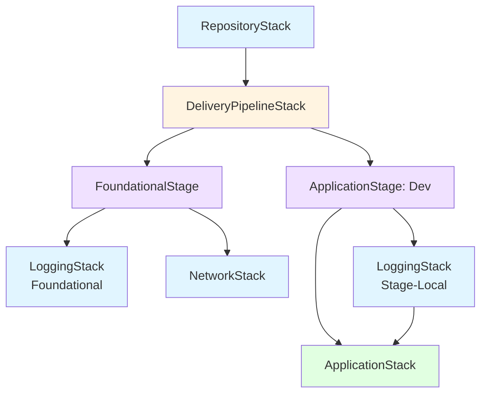
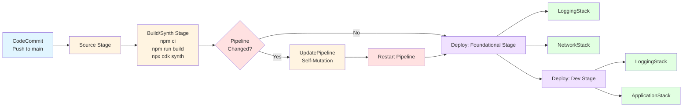
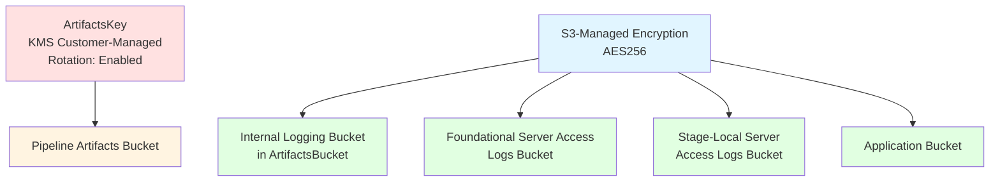
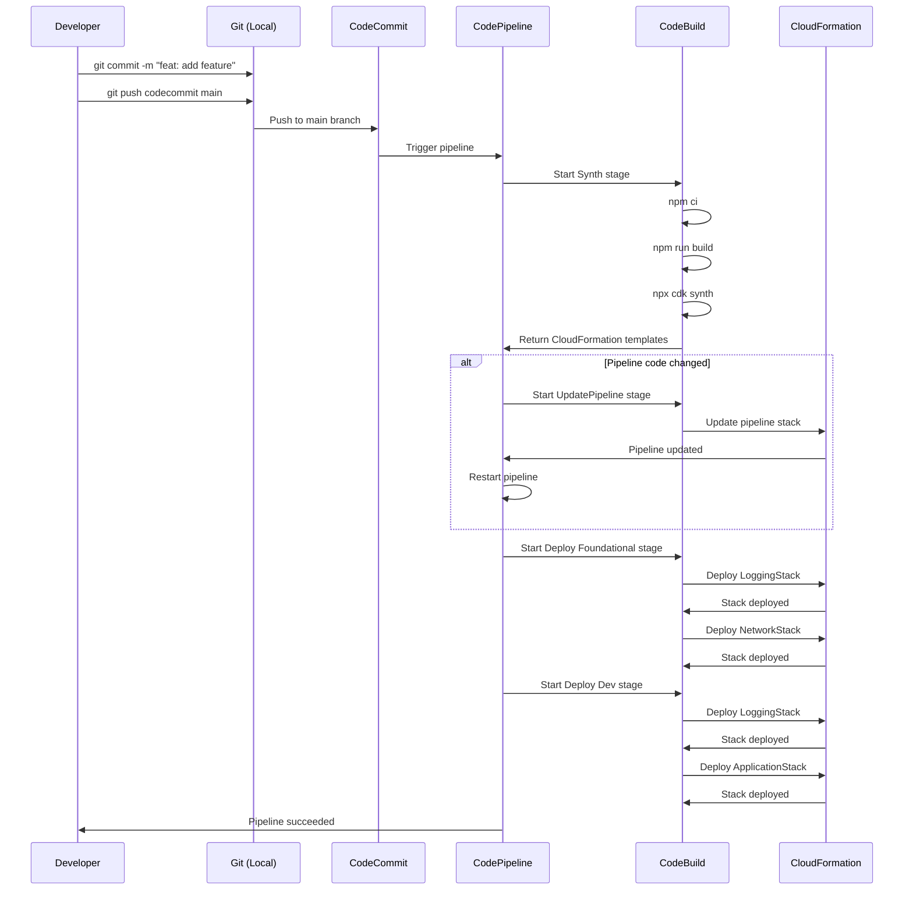
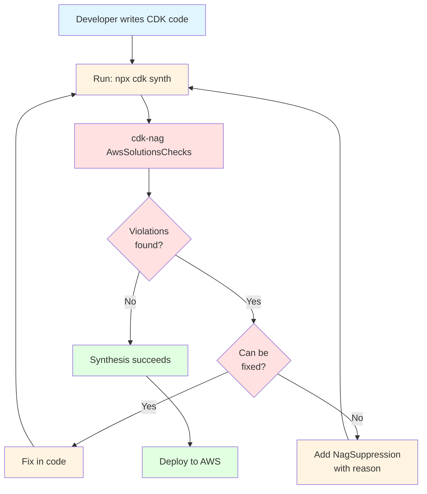
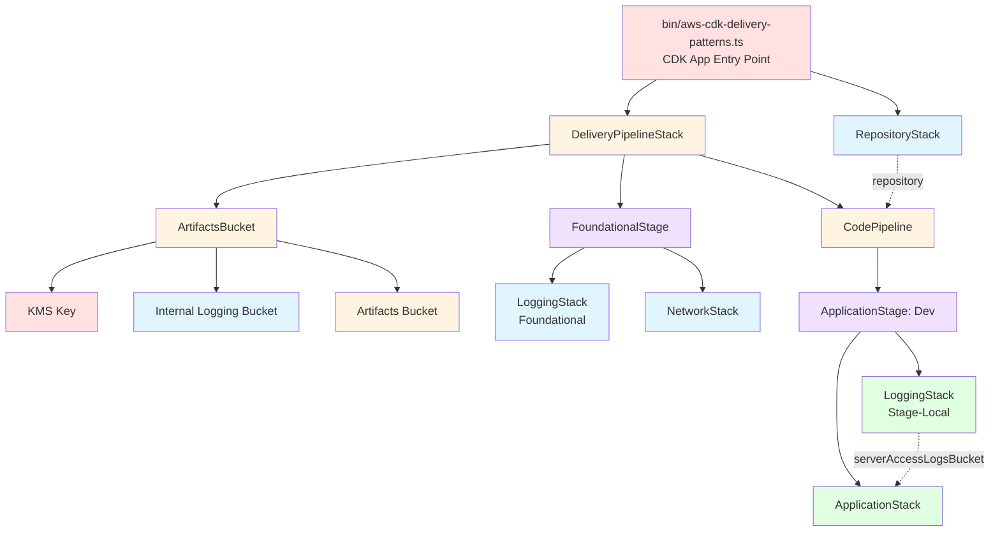
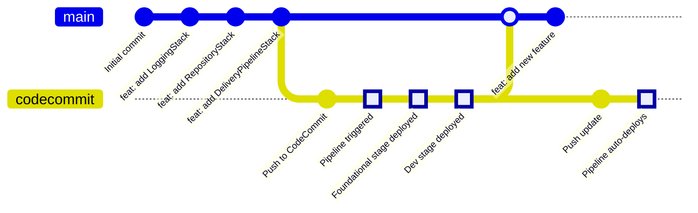
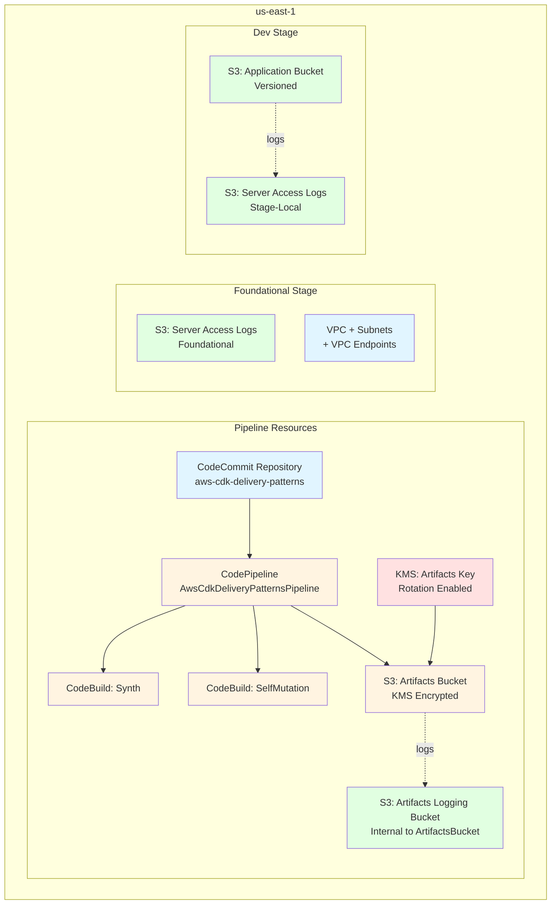

# Architecture Diagrams

## Stack Dependencies

## Pipeline Flow

## Logging Architecture

```mermaid
graph TD
    subgraph "Pipeline Level"
        A[Pipeline Artifacts Bucket<br/>KMS Encrypted] -.->|access logs| B[Internal Logging Bucket<br/>within ArtifactsBucket<br/>S3 Managed]
    end

    subgraph "Foundational Stage"
        C[Shared Server Access<br/>Logs Bucket<br/>S3 Managed]
    end

    subgraph "Dev Stage"
        D[Application Bucket<br/>Versioned<br/>S3 Managed] -.->|access logs| E[Stage-Local Server<br/>Access Logs Bucket<br/>S3 Managed]
    end

    subgraph "Prod Stage (Future)"
        F[Application Bucket<br/>Versioned<br/>S3 Managed] -.->|access logs| G[Stage-Local Server<br/>Access Logs Bucket<br/>S3 Managed]
    end

    style A fill:#fff4e1
    style B fill:#e1f5ff
    style C fill:#e1f5ff
    style D fill:#e1ffe1
    style E fill:#e1f5ff
    style F fill:#e1ffe1
    style G fill:#e1f5ff
```

## Resource Encryption

## Deployment Sequence

## Security Controls Flow

## CDK App Structure

## Git Workflow

## AWS Resource Map

## Legend

- 🔵 Blue: Logging/Infrastructure
- 🟡 Yellow: Pipeline/Build
- 🟣 Purple: Stage/Grouping
- 🟢 Green: Application Resources
- 🔴 Red: Security/Keys/Decisions
